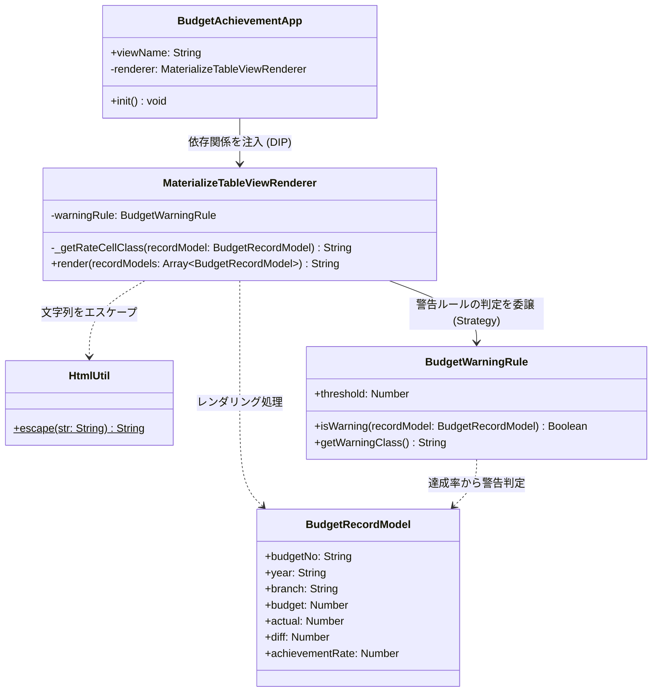
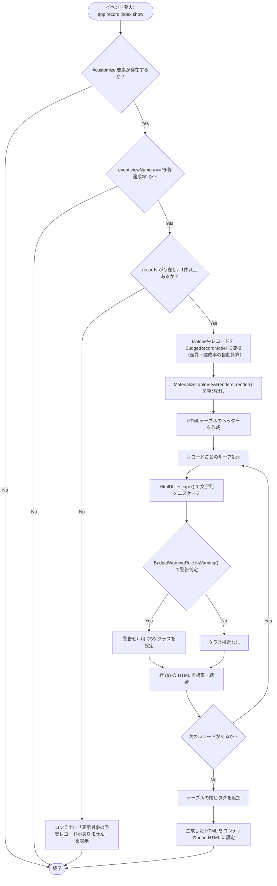

# budget_achievement.js 詳細仕様書（SOLID原則リファクタリング版）

本書は、予実管理アプリにおけるカスタマイズビュー「予算達成率」を表示するためのJavaScriptプログラム（`budget_achievement.js`）の詳細仕様について定義します。
本プログラムは、**SOLID原則**に基づき、保守性・可読性・拡張性を重視した設計で実装されています。

---

## 1. アーキテクチャ設計 (SOLID原則の適用)
本プログラムは、機能ごとの役割（責務）を分離し、将来的な表示スタイルの変更やビジネスルールの追加に柔軟に対応できるように設計されています。

### 1.1. クラス構成と責務

| クラス名 | 責務 (SRP) | SOLID原則に関連する設計方針 |
| :--- | :--- | :--- |
| **`HtmlUtil`** | HTML文字列のエスケープ処理（セキュリティ） | 共通ユーティリティとしての単一責務。 |
| **`BudgetRecordModel`** | kintoneの生データからドメインモデルへの変換、差異・達成率の計算（ビジネスロジック） | UI表示や外部フレームワークに依存せず、計算規則のみをカプセル化する。 |
| **`BudgetWarningRule`** | 警告を表示するしきい値や、警告用のスタイル定義（判定ルール） | **Open/Closed（開放閉鎖）の原則:** 警告ルール（100%未満等）や色を拡張・変更する際、他のクラスに影響を与えない。 |
| **`MaterializeTableViewRenderer`** | モデルデータを受け取り、Materialize CSSを適用したHTMLテーブルを構築する（描画処理） | **Liskov Substitution（リスコフの置換）の原則:** 抽象化されたレンダラー定義に従い、他のCSSフレームワーク用のレンダラーと安全に置換可能。 |
| **`BudgetAchievementApp`** | kintoneのライフサイクルイベント監視、ModelとViewの仲介（コントローラー） | **Dependency Inversion（依存性逆転）の原則:** 具体的なCSS定義に依存せず、抽象化された `renderer` オブジェクトにのみ依存する。 |

---

### 1.2. クラス図
以下は、各クラスの関係性とメソッド定義を表したクラス図です。

---

### 1.3. 処理フロー
以下は、プログラムのイベント発生からデータ処理、および画面描画が行われるまでの詳細フロー図です。

---

## 2. 動作条件・イベント制御

### 2.1. 起動イベント
- **イベント名:** `app.record.index.show`（レコード一覧画面が表示されたタイミング）
- **備考:** ページネーション（改ページ）の切り替えや、ソート順の変更時にもこのイベントが再発火し、再レンダリングされます。

### 2.2. ガードロジック（実行判定）
プログラムの誤動作を防ぐため、以下の条件に合致しない場合は処理を中断（早期リターン）します。

| 判定対象 | 条件 | 満たさない場合の挙動 |
| :--- | :--- | :--- |
| **描画コンテナ** | `div#customize` が画面に存在すること | 処理を中断（標準ビューへの影響防止） |
| **現在の一覧名** | `event.viewName` が `'予算達成率'` であること | 処理を中断（他の一覧への影響防止） |

### 2.3. データなし（0件）時の制御
取得したレコード数（`event.records.length`）が `0` 件、またはレコード自体が存在しない場合、テーブルの代わりに以下のメッセージをコンテナ内に表示します。
- **表示内容:** `表示対象の予実レコードがありません。`（Materializeのフォントサイズクラス `flow-text` を適用）

---

## 3. データ処理・計算仕様 (Model: `BudgetRecordModel`)

### 3.1. 取得フィールド
各レコードから以下のフィールド値を取得します。値が存在しない場合のデフォルト値も規定します。

| フィールド名 | フィールドコード | 内部データ型 | 値がない場合のデフォルト値 |
| :--- | :--- | :--- | :--- |
| **予算No** | `予算No` | 文字列 | `''`（空文字） |
| **年度** | `年度` | 文字列 | `''`（空文字） |
| **拠点** | `拠点` | 文字列 | `''`（空文字） |
| **予算** | `予算` | 数値型（`Number`） | `0` |
| **実績** | `実績` | 数値型（`Number`） | `0` |

### 3.2. 差異の算出
実績から予算を引いた数値を算出します。
- **計算式:** `差異 = 実績 - 予算`
- **表示フォーマット:**
  - 金額を3桁カンマ区切りにする（`toLocaleString()` を適用）。
  - 算出結果が `0` 以上の正数の場合、数値の先頭に `+` を付与する。
  - 末尾に ` 円` を付与する。（例: `+150,000 円`, `-50,000 円`）

### 3.3. 達成率の算出とゼロ除算防止
予算に対する実績の割合（%）を算出します。
- **計算式:** `達成率 (%) = (実績 / 予算) * 100`
- **ゼロ除算 (Division by Zero) 防止ガード:**
  - 予算が `0` または空欄（デフォルト値 `0`）の場合は計算を行わず、達成率を **`0.00 %`** とします。
- **丸め処理（小数点第3位以下切り捨て）:**
  - 小数点第3位以下を数学的に切り捨てるため、`Math.floor(rawRate * 100) / 100` を用いて計算します。
  - 画面上には、`toFixed(2)` を用いて小数点以下第2位まで常に表示します。（例: `98.76 %`）

---

## 4. 表示・スタイリング仕様 (View/Renderer: `MaterializeTableViewRenderer`)

### 4.1. Materialize CSS とは
Materialize CSS は、Googleが提唱する**「マテリアルデザイン（Material Design）」**のガイドラインに沿って作られたモダンなフロントエンドCSSフレームワークです。
洗練された立体感やアニメーション、統一感のあるカラーパレットが特徴で、定義された特定のCSSクラス名（`striped` や `red lighten-5` など）をHTML要素に付与するだけで、美しく直感的なインターフェースを簡単に構築することができます。
本プログラムでは、CDN経由でライブラリをインポートしてテーブル表示のデザイン最適化に利用しています。

### 4.2. テーブル全体のスタイル
生成する `<table>` 要素には以下のMaterializeクラスを適用します。
- `striped`: 行ごとに背景色が交互に変わるストライプ表示。
- `responsive-table`: 画面幅に合わせて横スクロール可能なレスポンシブ対応。
- `highlight`: マウスホバー時に対象行をハイライト。

### 4.3. 表ヘッダー定義
テーブルヘッダー（`<thead>`）には以下の列名を定義します（左からの配置順）。
1. **予算No**
2. **年度**
3. **拠点**
4. **予算**
5. **実績**
6. **差異**
7. **達成率**

### 4.4. 達成率100%未満のハイライト (Strategy: `BudgetWarningRule`)
達成率が **100%未満** のレコードに対しては、達成率を表示するセル（`<td>`）のみスタイルを以下のように変更します。

| 項目 | 適用する Materialize クラス | 効果 |
| :--- | :--- | :--- |
| **背景色** | `red lighten-5` | ごく淡い赤色の背景 |
| **文字色** | `red-text text-accent-4` | 濃い鮮やかな赤文字 |
| **フォント** | inline: `font-weight: bold;` | 太字表記 |

---

## 5. セキュリティ設計 (Utility: `HtmlUtil`)

ユーザーが任意に入力可能な文字列型フィールド（`予算No`, `年度`, `拠点`）をHTMLとして画面に出力する際、悪意あるスクリプトの実行（クロスサイトスクリプティング: XSS）を防ぐため、専用のエスケープ関数（`escapeHtml`）を通してHTMLエンティティに変換します。

### エスケープ置換テーブル

| 置換前文字 | 置換後エンティティ | 説明 |
| :---: | :---: | :--- |
| `&` | `&amp;` | アンパサンド |
| `<` | `&lt;` | 不等号（より小さい） |
| `>` | `&gt;` | 不等号（より大きい） |
| `"` | `&quot;` | ダブルクォーテーション |
| `'` | `&#39;` | シングルクォーテーション |

---

## 6. プログラムソースコード

本仕様書に基づき実装されたコードは以下を参照してください。
- ファイルパス: [budget_achievement.js](file:///z:/kintone/src/課題/budget_achievement.js)
