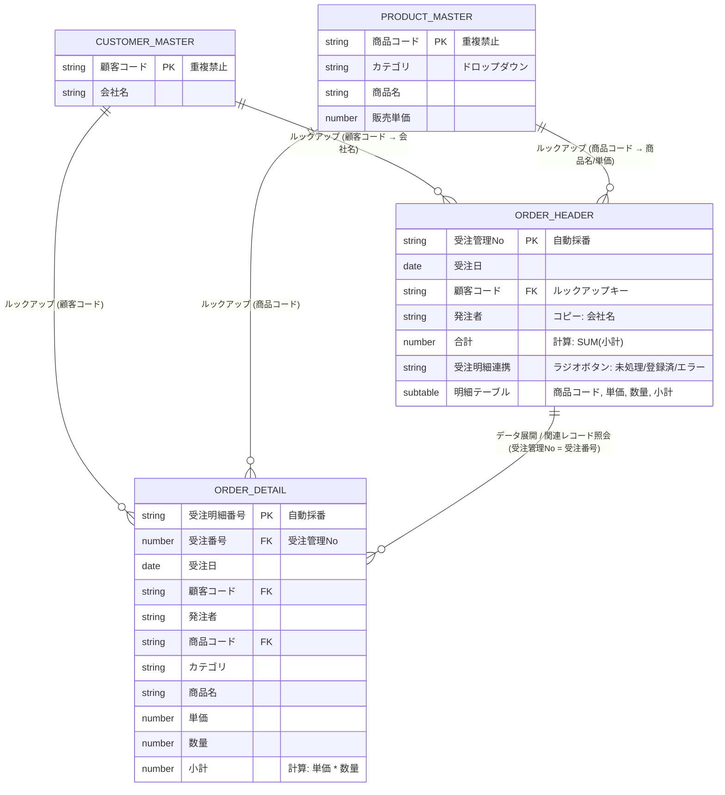
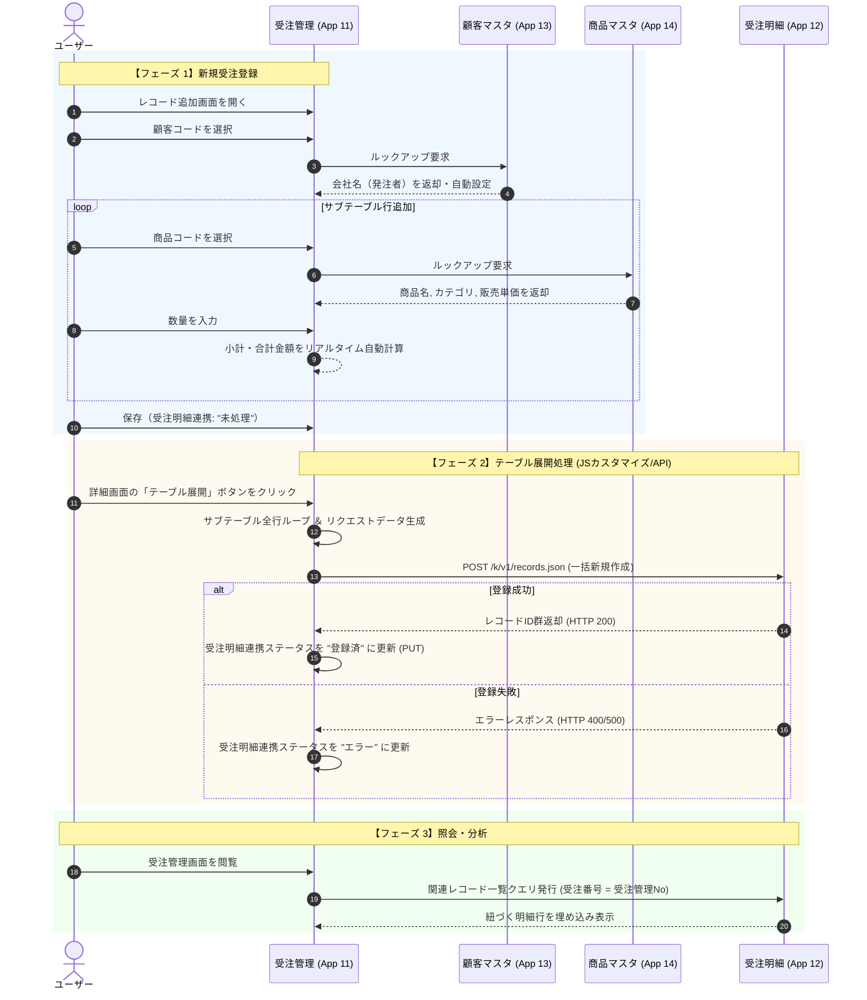

# 受注管理システム アーキテクチャ＆実装仕様書

> **対象読者:** 本システムの開発・保守・拡張を行うすべての開発者・エンジニア  
> **最終更新日:** 2026年8月2日  
> **文書バージョン:** 2.0.0

---

## 1. システム概要 & アーキテクチャ設計思想

### 1.1. システムの目的
本システムは、kintone上で動作する効率的な**受注データ管理および明細分析プラットフォーム**です。  
受注入力作業の効率化と、売上集計・商品別分析の柔軟性を両立させるため、ヘッダー・明細分離構成およびマスタ参照モデルを採用しています。

### 1.2. 設計思想（ヘッダー・明細分離パターン）
* **ヘッダー・明細の分離 (1対N構造):**  
  kintone標準のサブテーブルは画面上での一括入力に優れていますが、標準機能での集計・クロス分析に制約があります。そのため、**入力は「受注管理アプリ（サブテーブル）」で行い、データ処理によって「受注明細アプリ（フラット行）」へ展開・書き出し**を行う設計をとっています。
* **マスタデータの一括参照 (ルックアップ & コピー):**  
  顧客情報・商品情報は各マスタアプリを一意なコード（キー）で参照し、ルックアップ機能によって会社名や単価を自動補完・同期します。これにより表記揺れと入力ミスを防止します。

### 1.3. システム構成アプリ一覧

| アプリID | アプリ名 | 種別 | 役割・概要 |
| :---: | :--- | :---: | :--- |
| **11** | **【入社前研修】受注管理** | トランザクション (Header) | 受注全体（顧客・日付）および明細サブテーブルの入力・管理を行うメイン画面 |
| **12** | **【入社前研修】受注明細** | トランザクション (Line) | 受注サブテーブルの各行を1レコード単位で保持し、集計・分析を行う基盤 |
| **13** | **【入社前研修】顧客マスタ** | マスタ (Master) | 顧客コードと会社名の一元管理 |
| **14** | **【入社前研修】商品マスタ** | マスタ (Master) | 商品コード、カテゴリ、商品名、販売単価の一元管理 |

---

## 2. システム用語集

| 用語 | 本システムにおける定義・意味 |
| :--- | :--- |
| **ルックアップ** | 他のアプリ（顧客マスタ・商品マスタ）から情報を検索・取得し、フィールドへ自動入力するkintone機能。 |
| **サブテーブル** | 受注管理アプリ内で1つの受注に対して複数の商品明細を追記できる動的行テーブル構造。 |
| **テーブル展開** | 受注管理アプリのサブテーブル行を、受注明細アプリへ「1行＝1レコード」として分解・新規作成（POST）する処理。 |
| **関連レコード一覧** | 受注管理アプリの画面上に、紐づく受注明細アプリのレコードをリアルタイムで自動表示する参照表示領域。 |

---

## 3. ER図 & データリレーションシップ

### 3.1. Entity-Relationship Diagram (ERD)



### 3.2. ルックアップ & コピーフィールドマッピング表

| 参照元アプリ (AppID) | 参照キー (Key) | コピー元フィールド | 参照先アプリ (AppID) | 補完先フィールド |
| :--- | :--- | :--- | :--- | :--- |
| **顧客マスタ (13)** | `顧客コード` | `会社名` | **受注管理 (11)** | `発注者` |
| **商品マスタ (14)** | `商品コード` | `カテゴリ` | **受注管理 (11) Table** | `カテゴリ` |
| **商品マスタ (14)** | `商品コード` | `商品名` | **受注管理 (11) Table** | `商品名` |
| **商品マスタ (14)** | `商品コード` | `販売単価` | **受注管理 (11) Table** | `販売単価` |

---

## 4. アプリケーション詳細仕様

### 4.1. 【入社前研修】受注管理 (AppID: 11)

#### アプリ機能説明・画面役割
* **役割:** 受注取引の受付・入力を行うメインポータル。
* **画面機能:**
  * **ヘッダー入力:** 受注日・顧客コードの選択（ルックアップ）。
  * **動的サブテーブル入力:** 複数商品の追加、商品選択（ルックアップ）、数量入力、小計/合計自動計算。
  * **展開状況可視化:** `受注明細連携` フラグによる連携ステータス管理（`未処理` / `登録済` / `エラー`）。
  * **明細埋め込み照会:** 関連レコード一覧による連携済み明細のリアルタイム表示。

#### メインフィールド一覧

| フィールド名 | フィールドコード | フィールドタイプ | 必須 | 設定・計算式・備考 |
| :--- | :--- | :--- | :---: | :--- |
| 受注管理No | `受注管理No` | レコード番号 | - | **主キー** (システム自動採番) |
| 受注日 | `受注日` | 日付 | ○ | 受注日 |
| 顧客コード | `顧客コード` | 文字列 (単行) | ○ | 顧客マスタ (13) へのルックアップキー |
| 発注者 | `発注者` | 文字列 (単行) | - | 顧客マスタ.会社名 から自動コピー |
| 合計 | `合計` | 計算 | - | 計算式: `SUM(小計)` |
| 受注明細連携 | `受注明細連携` | ラジオボタン | ○ | 初期値: `未処理` (選択肢: `未処理`, `登録済`, `エラー`) |
| 関連レコード一覧 | `関連レコード一覧` | 関連レコード一覧 | - | 参照先: 受注明細 (12), 条件: `受注番号` = `受注管理No` |

#### サブテーブル仕様 (`Table`)

| フィールド名 | フィールドコード | フィールドタイプ | 必須 | 設定・計算式・備考 |
| :--- | :--- | :--- | :---: | :--- |
| 商品コード | `商品コード` | 文字列 (単行) | ○ | 商品マスタ (14) へのルックアップキー |
| カテゴリ | `カテゴリ` | 文字列 (単行) | - | 商品マスタ.カテゴリ から自動コピー |
| 商品名 | `商品名` | 文字列 (単行) | - | 商品マスタ.商品名 から自動コピー |
| 販売単価 | `販売単価` | 数値 | - | 商品マスタ.販売単価 から自動コピー |
| 数量 | `数量` | 数値 | ○ | 購入数量 (数値入力) |
| 小計 | `小計` | 計算 | - | 計算式: `販売単価 * 数量` |

---

### 4.2. 【入社前研修】受注明細 (AppID: 12)

#### アプリ機能説明・画面役割
* **役割:** 受注管理アプリから転送・展開された各明細行を、集計・分析用に1行1レコードで格納するトランザクションDB。
* **画面機能:** カテゴリ別売上・商品別出荷数・顧客別購買傾向などのクロス集計・グラフ表示。

#### フィールド一覧

| フィールド名 | フィールドコード | フィールドタイプ | 必須 | 設定・備考 |
| :--- | :--- | :--- | :---: | :--- |
| 受注明細番号 | `受注明細番号` | レコード番号 | - | **主キー** (システム自動採番) |
| 受注番号 | `受注番号` | 数値 | ○ | **親FK** (受注管理アプリの `受注管理No`) |
| 受注日 | `受注日` | 日付 | ○ | 親受注データより連携 |
| 顧客コード | `顧客コード` | 文字列 (単行) | ○ | 親受注データより連携 |
| 発注者 | `発注者` | 文字列 (単行) | - | 親受注データより連携 |
| 商品コード | `商品コード` | 文字列 (単行) | ○ | 明細テーブル行より連携 |
| カテゴリ | `カテゴリ` | 文字列 (単行) | - | 明細テーブル行より連携 |
| 商品名 | `商品名` | 文字列 (単行) | - | 明細テーブル行より連携 |
| 単価 | `単価` | 数値 | ○ | 明細テーブル行より連携 |
| 数量 | `数量` | 数値 | ○ | 明細テーブル行より連携 |
| 小計 | `小計` | 計算 / 数値 | - | 計算式: `単価 * 数量` または連携値 |

---

### 4.3. 【入社前研修】顧客マスタ (AppID: 13)

#### フィールド一覧

| フィールド名 | フィールドコード | フィールドタイプ | 重複 | 設定・備考 |
| :--- | :--- | :--- | :---: | :--- |
| 顧客コード | `顧客コード` | 文字列 (単行) | 禁止 (○) | **主キー** (例: `CUST-001`) |
| 会社名 | `会社名` | 文字列 (単行) | 許可 | 顧客企業名称 |

---

### 4.4. 【入社前研修】商品マスタ (AppID: 14)

#### フィールド一覧

| フィールド名 | フィールドコード | フィールドタイプ | 重複 | 設定・備考 |
| :--- | :--- | :--- | :---: | :--- |
| 商品コード | `商品コード` | 文字列 (単行) | 禁止 (○) | **主キー** (例: `ITEM-001`) |
| カテゴリ | `カテゴリ` | ドロップダウン | - | 選択肢: `果物`, `お菓子`, `飲み物` |
| 商品名 | `商品名` | 文字列 (単行) | 許可 | 商品正式名称 |
| 販売単価 | `販売単価` | 数値 | - | 標準販売単価 (円) |

---

## 5. 業務・データ処理フロー

### 5.1. 全体ライフサイクル（シーケンス図）



---

## 6. カスタマイズ開発ガイド (JavaScript / API)

初めてJavaScriptカスタマイズやAPI連携コードを記述・保守する開発者向けの技術仕様です。

### 6.1. 開発ルール＆制約事項
* **SDKライブラリ制約:** 本課題・研修要件として `@kintone/rest-api-client` は使用せず、**`kintone.api()` または Vanilla JS (Fetch API / XMLHttpRequest)** で実装してください。
* **二重登録防止 (冪等性の確保):** 「テーブル展開」ボタン押下時、既に `受注明細連携` が `登録済` の場合は処理をダイアログで中断させてください。

### 6.2. イベントタイプとボタン設置位置

| 画面 | イベントタイプ | 実装内容 |
| :--- | :--- | :--- |
| **詳細画面** | `app.record.detail.show` | `kintone.app.getHeaderMenuSpaceElement()` でヘッダーメニュー領域を取得し、「テーブル展開」ボタンを生成・配置 |
| **追加/編集画面** | `app.record.create.show`<br>`app.record.edit.show` | テーブル追加時の初期設定や制御 |

### 6.3. APIエンドポイント & リクエスト仕様（テーブル展開時）

#### 1. 明細レコード一括登録 (POST)
* **Endpoint:** `/k/v1/records.json`
* **Method:** `POST`
* **Payload構造例:**
```json
{
  "app": 12,
  "records": [
    {
      "受注番号": { "value": "101" },
      "受注日": { "value": "2026-08-01" },
      "顧客コード": { "value": "CUST-001" },
      "発注者": { "value": "株式会社サンプル" },
      "商品コード": { "value": "ITEM-001" },
      "カテゴリ": { "value": "果物" },
      "商品名": { "value": "りんご" },
      "単価": { "value": "150" },
      "数量": { "value": "10" },
      "小計": { "value": "1500" }
    }
  ]
}
```

---

## 7. 保守・トラブルシューティング

### 7.1. よくある問題と対応手順

| 現象・課題 | 原因 | 復旧・対応手順 |
| :--- | :--- | :--- |
| **連携ステータスが「エラー」になる** | 明細アプリへのアクセス権限不足、必須入力漏れ、またはネットワークエラー | 1. ブラウザコンソールのエラーログを確認<br>2. 入力データ（商品コード・単価等）の不整合を確認<br>3. 修正後、再度「テーブル展開」ボタンを押下 |
| **受注明細アプリに重複して登録される** | ボタンの連打、または複数回実行 | ボタン押下時に `button.disabled = true` に設定して連続クリックを抑止する |
| **受注管理の数量変更が明細アプリに反映されない** | 片方向連携仕様のため、受注明細アプリは自動更新されない | 仕様として片方向連携。元データを再連携する場合は、対象受注番号の明細レコードを削除後に再展開する |

### 7.2. 権限設定チェックリスト
開発・テスト時に以下のアクセス権限が正しく設定されているか確認してください。
* [ ] **受注管理アプリ:** レコード閲覧・追加・編集権限
* [ ] **受注明細アプリ:** レコード追加・閲覧権限（API経由の追加を許可）
* [ ] **顧客マスタ / 商品マスタ:** レコード閲覧権限（ルックアップ参照用）