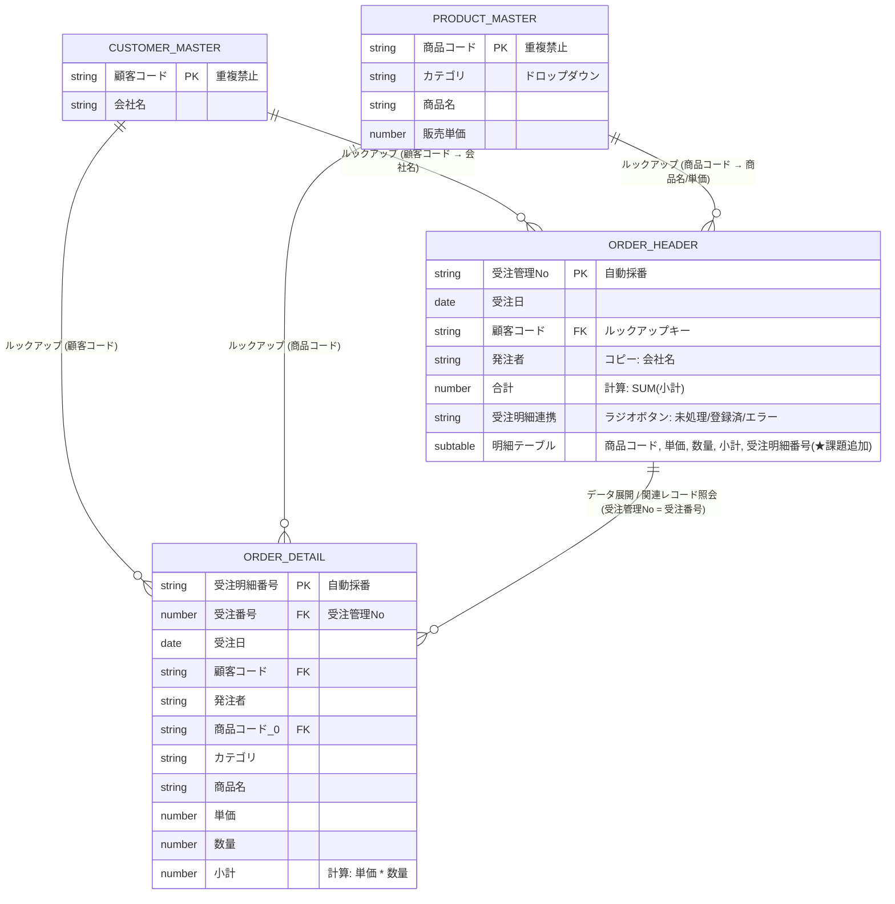
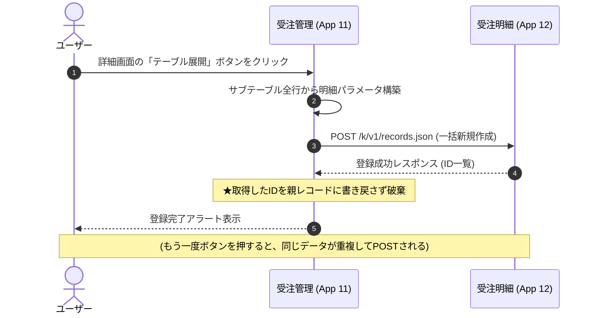
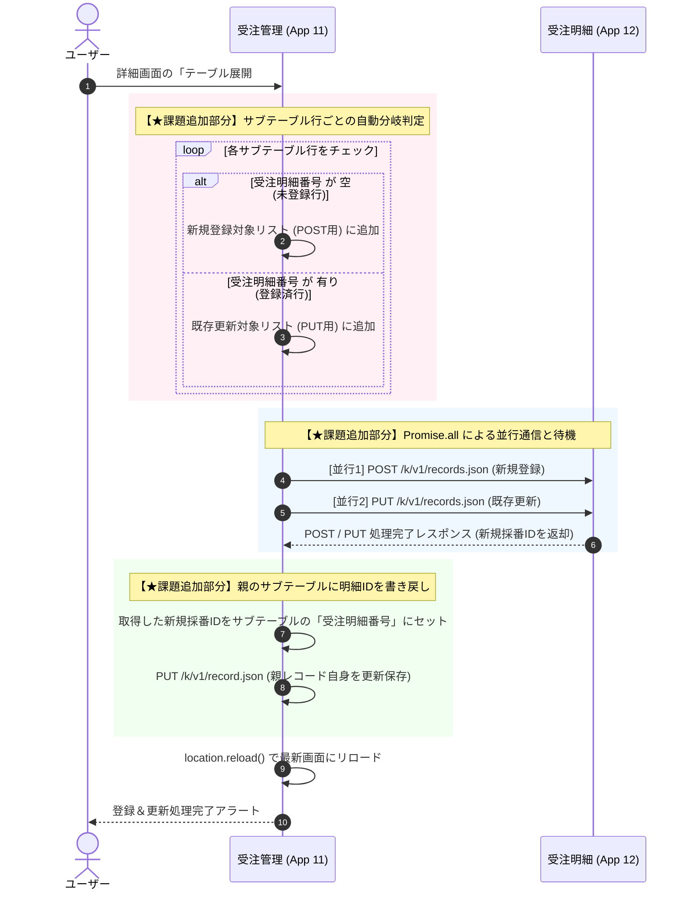

# 受注管理システム アーキテクチャ＆実装仕様書

> **対象読者:** 本システムの開発・保守・拡張を行うすべての開発者・エンジニア  
> **最終更新日:** 2026年8月2日  
> **文書バージョン:** 2.2.0 (チーム開発・保守ガイドライン追記版)

---

## 1. システム概要 & アーキテクチャ設計思想

### 1.1. システムの目的
本システムは、kintone上で動作する効率的な**受注データ管理および明細分析プラットフォーム**です。  
受注入力作業の効率化と、売上集計・商品別分析の柔軟性を両立させるため、ヘッダー・明細分離構成およびマスタ参照モデルを採用しています。

### 1.2. 設計思想（ヘッダー・明細分離パターン）
* **ヘッダー・明細の分離 (1対N構造):**  
  kintone標準 of サブテーブルは画面上での一括入力に優れていますが、標準機能での集計・クロス分析に制約があります。そのため、**入力は「受注管理アプリ（サブテーブル）」で行い、データ処理によって「受注明細アプリ（フラット行）」へ展開・書き出し**を行う設計をとっています。
* **マスタデータの一括参照 (ルックアップ & コピー):**  
  顧客情報・商品情報は各マスタアプリを一意なコード（キー）で参照し、ルックアップ機能によって会社名や単価を自動補完・同期します。これにより表記揺れと入力ミスを防止します。

### 1.3. システム構成アプリ一覧

| アプリID | アプリ名 | 種別 | 役割・概要 |
| :---: | :--- | :---: | :--- |
| **22** | **【入社前研修】受注管理** | トランザクション (Header) | 受注全体（顧客・日付）および明細サブテーブルの入力・管理を行うメイン画面 |
| **24** | **【入社前研修】受注明細** | トランザクション (Line) | 受注サブテーブルの各行を1レコード単位で保持し、集計・分析を行う基盤 |
| **23** | **【入社前研修】顧客マスタ** | マスタ (Master) | 顧客コードと会社名の一元管理 |
| **25** | **【入社前研修】商品マスタ** | マスタ (Master) | 商品コード、カテゴリ、商品名、販売単価の一元管理 |

---

## 2. システム用語集

| 用語 | 本システムにおける定義・意味 |
| :--- | :--- |
| **ルックアップ** | 他のアプリ（顧客マスタ・商品マスタ）から情報を検索・取得し、フィールドへ自動入力するkintone機能。 |
| **サブテーブル** | 受注管理アプリ内で1つの受注に対して複数の商品明細を追記できる動的行テーブル構造。 |
| **テーブル展開** | 受注管理アプリのサブテーブル行を、受注明細アプリへ「1行＝1レコード」として分解・新規作成（POST）する処理。 |
| **関連レコード一覧** | 受注管理アプリの画面上に、紐づく受注明細アプリのレコードをリアルタイムで自動表示する参照表示領域。 |
| **受注明細番号** | **【★課題で追加】** 明細アプリで自動発番された一意のレコードID。親である受注管理のサブテーブル行に書き戻され、データ紐付けと更新判定キーに使用されます。 |

---

## 3. ER図 & データリレーションシップ

### 3.1. Entity-Relationship Diagram (ERD)



### 3.2. ルックアップ & コピーフィールドマッピング表

| 参照元アプリ (AppID) | 参照キー (Key) | コピー元フィールド | 参照先アプリ (AppID) | 補完先フィールド |
| :--- | :--- | :--- | :--- | :--- |
| **顧客マスタ (13)** | `顧客コード` | `会社名` | **受注管理 (11)** | `発注者` |
| **商品マスタ (14)** | `商品コード` | `カテゴリ` | **受注管理 (11) Table** | `カテゴリ` |
| **商品マスタ (14)** | `商品コード` | `商品名` | **受注管理 (11) Table** | `商品名` |
| **商品マスタ (14)** | `商品コード` | `販売単価` | **受注管理 (11) Table** | `販売単価` |

---

## 4. アプリケーション詳細仕様

### 4.1. 【入社前研修】受注管理 (AppID: 11)

#### アプリ機能説明・画面役割
* **役割:** 受注取引の受付・入力を行うメインポータル。
* **画面機能:**
  * **ヘッダー入力:** 受注日・顧客コードの選択（ルックアップ）。
  * **動的サブテーブル入力:** 複数商品の追加、商品選択（ルックアップ）、数量入力、小計/合計自動計算。
  * **展開状況可視化:** `受注明細連携` フラグによる連携ステータス管理（`未処理` / `登録済` / `エラー`）。
  * **明細埋め込み照会:** 関連レコード一覧による連携済み明細のリアルタイム表示。

#### メインフィールド一覧

| フィールド名 | フィールドコード | フィールドタイプ | 必須 | 設定・計算式・備考 |
| :--- | :--- | :--- | :---: | :--- |
| 受注管理No | `受注管理No` | レコード番号 | - | **主キー** (システム自動採番) |
| 受注日 | `受注日` | 日付 | ○ | 受注日 |
| 顧客コード | `顧客コード` | 文字列 (単行) | ○ | 顧客マスタ (13) へのルックアップキー |
| 発注者 | `発注者` | 文字列 (単行) | - | 顧客マスタ.会社名 から自動コピー |
| 合計 | `合計` | 計算 | - | 計算式: `SUM(小計)` |
| 受注明細連携 | `受注明細連携` | ラジオボタン | ○ | 初期値: `未処理` (選択肢: `未処理`, `登録済`, `エラー`) |
| 関連レコード一覧 | `関連レコード一覧` | 関連レコード一覧 | - | 参照先: 受注明細 (12), 条件: `受注番号` = `受注管理No` |

#### サブテーブル仕様 (`Table`)

| フィールド名 | フィールドコード | フィールドタイプ | 必須 | 設定・計算式・備考 |
| :--- | :--- | :--- | :---: | :--- |
| 商品コード | `商品コード` | 文字列 (単行) | ○ | 商品マスタ (14) へのルックアップキー |
| カテゴリ | `カテゴリ` | 文字列 (単行) | - | 商品マスタ.カテゴリ から自動コピー |
| 商品名 | `商品名` | 文字列 (単行) | - | 商品マスタ.商品名 から自動コピー |
| 販売単価 | `販売単価` | 数値 | - | 商品マスタ.販売単価 から自動コピー |
| 数量 | `数量` | 数値 | ○ | 購入数量 (数値入力) |
| 小計 | `小計` | 計算 | - | 計算式: `販売単価 * 数量` |
| **受注明細番号** | `受注明細番号` | 文字列 (単行) | - | **【★課題で追加】** 明細側から書き戻されたレコード番号を保存するフィールド |

---

### 4.2. 【入社前研修】受注明細 (AppID: 12)

#### アプリ機能説明・画面役割
* **役割:** 受注管理アプリから転送・展開された各明細行を、集計・分析用に1行1レコードで格納するトランザクションDB。
* **画面機能:** カテゴリ別売上・商品別出荷数・顧客別購買傾向などのクロス集計・グラフ表示。

#### フィールド一覧

| フィールド名 | フィールドコード | フィールドタイプ | 必須 | 設定・備考 |
| :--- | :--- | :--- | :---: | :--- |
| 受注明細番号 | `受注明細番号` | レコード番号 | - | **主キー** (システム自動採番) |
| 受注番号 | `受注番号` | 数値 | ○ | **親FK** (受注管理アプリの `受注管理No`) |
| 受注日 | `受注日` | 日付 | ○ | 親受注データより連携 |
| 顧客コード | `顧客コード` | 文字列 (単行) | ○ | 親受注データより連携 |
| 発注者 | `発注者` | 文字列 (単行) | - | 親受注データより連携 |
| 商品コード | `商品コード_0` | 文字列 (単行) | ○ | 明細テーブル行より連携 |
| カテゴリ | `カテゴリ` | 文字列 (単行) | - | 明細テーブル行より連携 |
| 商品名 | `商品名` | 文字列 (単行) | - | 明細テーブル行より連携 |
| 単価 | `単価` | 数値 | ○ | 明細テーブル行より連携 |
| 数量 | `数量` | 数値 | ○ | 明細テーブル行より連携 |
| 小計 | `小計` | 計算 / 数値 | - | 計算式: `単価 * 数量` または連携値 |

---

## 5. 業務・データ処理フロー (課題前 vs 課題終了後)

### 5.1. 課題適用前の処理フロー (初期状態)
課題適用の初期（CN-057-9-1時点）では、親テーブルから明細アプリへ一方行に新規登録 (`POST`) を行うだけでした。この構成には、以下の設計上の問題（課題）がありました。
- **データの一貫性の欠如:** 明細アプリへ登録されても、親アプリのサブテーブル行は自身が登録済みかどうかの情報（ID）を持たない。
- **重複登録リスク:** 「テーブル展開」ボタンを複数回押下すると、同じ明細が何度も二重に登録されてしまう。

#### 課題前のシーケンス図 (単方向POSTのみ)


---

### 5.2. 課題終了後の処理フロー (双方向同期 ＆ 新規・更新自動判定)
研修課題の完了後（CN-057-9-4 / CN-059-9-3実装後）は、親アプリに「受注明細番号」フィールドを追加し、プログラム側で**新規登録 (`POST`)** と**既存更新 (`PUT`)** を自動判定して同期する極めて堅牢な双方向フローに進化しました。

- **重複の防止 (冪等性):** すでに連携されて「受注明細番号」がある行は、追加登録されずに明細アプリ側が自動で上書き更新 (`PUT`) されます。
- **双方向リンク:** 新規登録された行に対してのみ、採番された明細IDを取得し、親のサブテーブルの該当行へ即座に書き戻します。

#### 課題終了後のシーケンス図 (自動分岐 ＆ ID書き戻し)


---

## 6. カスタマイズ開発ガイド (JavaScript / API)

### 6.1. 課題を通じて追加実装したカスタマイズ機能一覧
開発者は、各段階の課題要件に応じて以下のJavaScriptカスタマイズを順次追加適用しました。

| 適用課題 | 実装ファイル | アクションボタン名 | 【★追加・変更された主な実装内容】 |
| :--- | :--- | :--- | :--- |
| **CN-057-9-1** | `table_expand_1.js` | `テーブル展開#1` | サブテーブルの全行データを抽出し、受注明細アプリ (AppID: 12) に一括で `POST` レコード登録する基本機能の実装。 |
| **CN-058-9-2** | `table_expand_2.js` | `テーブル展開#2` | `POST` 成功レスポンスから新規レコードID群を取得。親のサブテーブル既存行の `id` を維持しつつ、`受注明細番号` フィールドに値を書き戻す `PUT` 処理の追加。 |
| **CN-057-9-4**<br>**CN-059-9-3** | `table_expand_3.js` | `テーブル展開#3` | 各行の `受注明細番号` の有無を判定し、`newRows` (POST用) と `updateRecords` (PUT用) に自動分類。`Promise.all` で並行処理を行い、新規分のみIDを親へ書き戻す自動同期ロジックの追加。 |

### 6.2. 開発ルール＆制約事項
* **SDKライブラリ制約:** 本課題・研修要件として `@kintone/rest-api-client` は使用せず、**`kintone.api()` または Vanilla JS (Fetch API)** で実装してください。
* **サブテーブル更新時の注意 (行IDの維持):**  
  kintoneでサブテーブルを `PUT` 更新する際、各行オブジェクト内の `id: row.id` を正しく指定しないと、既存の行が削除されて新規行として再生成されてしまいます。行のデータ一貫性を保つため、必ず既存の行 ID をマッピングしてください。

### 6.3. APIエンドポイント & リクエスト仕様（テーブル展開時）

#### 1. 明細レコード一括登録 (POST)
* **Endpoint:** `/k/v1/records.json`
* **Method:** `POST`
* **Payload構造例:**
```json
{
  "app": 12,
  "records": [
    {
      "受注番号": { "value": "101" },
      "受注日": { "value": "2026-08-01" },
      "顧客コード": { "value": "CUST-001" },
      "商品コード": { "value": "ITEM-001" },
      "数量": { "value": "10" },
      "小計": { "value": "1500" }
    }
  ]
}
```

#### 2. 明細レコード一括更新 (PUT)
* **Endpoint:** `/k/v1/records.json`
* **Method:** `PUT`
* **Payload構造例:**
```json
{
  "app": 12,
  "records": [
    {
      "id": "201",
      "record": {
        "数量": { "value": "12" },
        "小計": { "value": "1800" }
      }
    }
  ]
}
```

---

## 7. 保守・トラブルシューティング

### 7.1. よくある問題と対応手順

| 現象・課題 | 原因 | 復旧・対応手順 |
| :--- | :--- | :--- |
| **連携ステータスが「エラー」になる** | 明細アプリへのアクセス権限不足、必須入力漏れ、またはネットワークエラー | 1. ブラウザコンソールのエラーログを確認<br>2. 入力データ（商品コード・単価等）の不整合を確認<br>3. 修正後、再度「テーブル展開」ボタンを押下 |
| **親レコードを更新した際、サブテーブルの他の行が消えてしまった** | 親レコードの `PUT` 通信時に、サブテーブル各行の `row.id` を維持せずにデータを送信したため | `row.id` を引き継ぐようにマッピング関数を修正します。（最新の `table_expand_3.js` は対策済みです） |
| **受注明細番号があるのに明細が更新されない** | 明細アプリ側の手動削除などにより、該当する明細番号のレコードが存在しなくなっている | コンソールの `HTTP 404 (Not Found)` エラーを確認。親の該当行の `受注明細番号` を一度空にしてから再実行します。 |

### 7.2. 権限設定チェックリスト
開発・テスト時に以下のアクセス権限が正しく設定されているか確認してください。
* [ ] **受注管理アプリ:** レコード閲覧・追加・編集権限
* [ ] **受注明細アプリ:** レコード追加・編集・閲覧権限（API経由の追加・更新を許可）
* [ ] **顧客マスタ / 商品マスタ:** レコード閲覧権限（ルックアップ参照用）

---

## 8. チーム開発・保守運用ガイドライン

チームで kintone カスタマイズソースコードを長期的かつ安全に運用・保守していくための開発標準ガイドラインです。

### 8.1. 環境移行と定数管理（ハードコーディングの排除）
ソースコード内に `App ID (22, 24, 23, 25)` を直接記述すると、本番環境・ステージング環境・開発環境間でアプリをコピーして移行する際、コードをすべて書き直す必要が生じ、デプロイミスの原因になります。
- **専門家のアドバイス:**  
  アプリIDやフィールドコードは、必ずファイルの先頭で定数 (`const CONFIG = { DETAIL_APP_ID: 24 };`) として一元定義してください。より大規模な開発では、設定値を外部JSONや kintone のプラグイン設定領域に切り出し、コードを変更せずに設定変更できる仕組み（Config パターン）を検討してください。

### 8.2. JS / CSS の外部読み込み管理とバージョンロック
外部のCSSフレームワークやJavaScriptライブラリ（Materialize CSS、jQuery、Luxonなど）をCDN経由で直接読み込む場合、ライブラリのバージョンを必ず固定してください。
- **専門家のアドバイス:**  
  CDN URLに `@latest` などの最新追従型表記を使用すると、外部ライブラリのアップデート時に破壊的変更が行われ、ある日突然アプリが動かなくなる危険性があります。必ず `.../materialize/1.0.0/...` のようにバージョンを静的に固定して読み込んでください。

### 8.3. イベント空間のコンテキスト保護 (グローバル汚染の防止)
kintone は単一のウェブページ上で複数の JavaScript プログラムやプラグインが同時に実行されます。グローバル変数や関数を宣言すると、他のプログラムと名前がバッティングして誤作動を起こします。
- **専門家のアドバイス:**  
  すべての JavaScript ファイルは、以下のように**即時関数 (IIFE)** および **`'use strict';`** でラップすることをチーム規約として義務付けてください。これにより変数のスコープをファイル内に局所化し、競合を完全に防ぎます。
  ```javascript
  (function() {
    'use strict';
    // ここに記述する変数はローカルスコープに保護される
  })();
  ```

### 8.4. エラーハンドリングとロギング標準
非同期通信（`kintone.api` 等）を行う際は、成功時だけでなく必ず `catch` ブロックを記述し、エラー情報をログに残すようにします。
- **専門家のアドバイス:**  
  `catch (err)` 内で `alert('エラーが発生しました')` だけで済ませると、現場のユーザーから「何が起きたか分からない」と問い合わせが入った際にトラブルシューティングが困難になります。  
  エラー詳細をコンソールに出力 (`console.error(err)`) するとともに、エラーメッセージがオブジェクトの場合は `JSON.stringify(err)` を用いて画面上に詳細なエラーメッセージやエラーコードを表示する、またはログ収集アプリにエラー情報を自動送信する機構を実装してください。