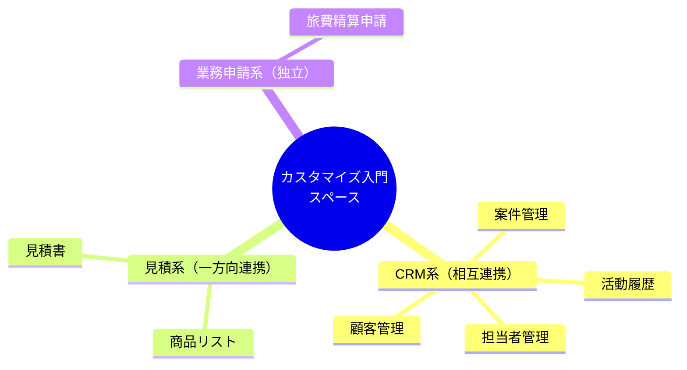
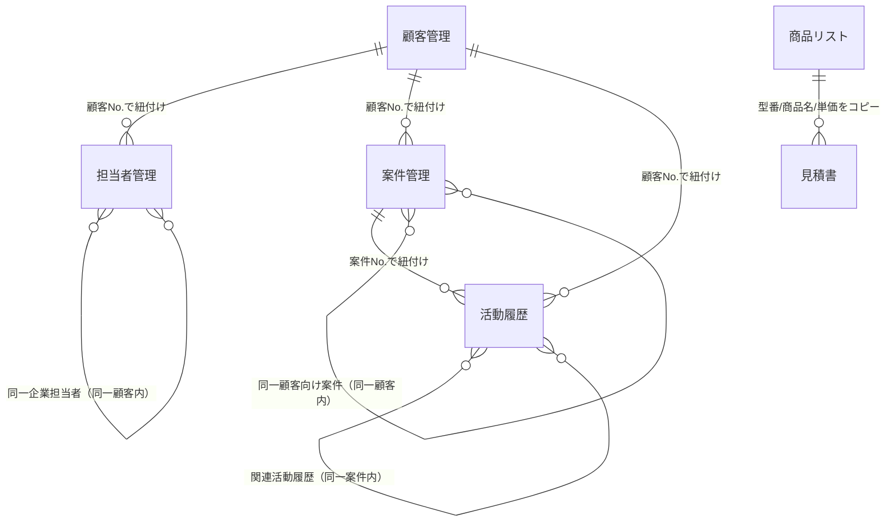
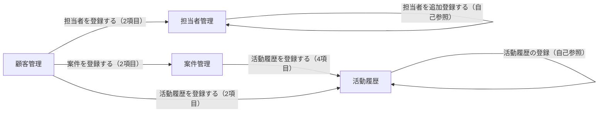
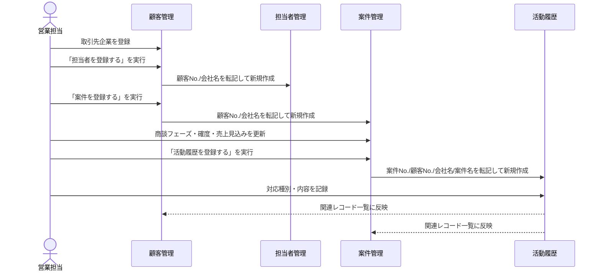
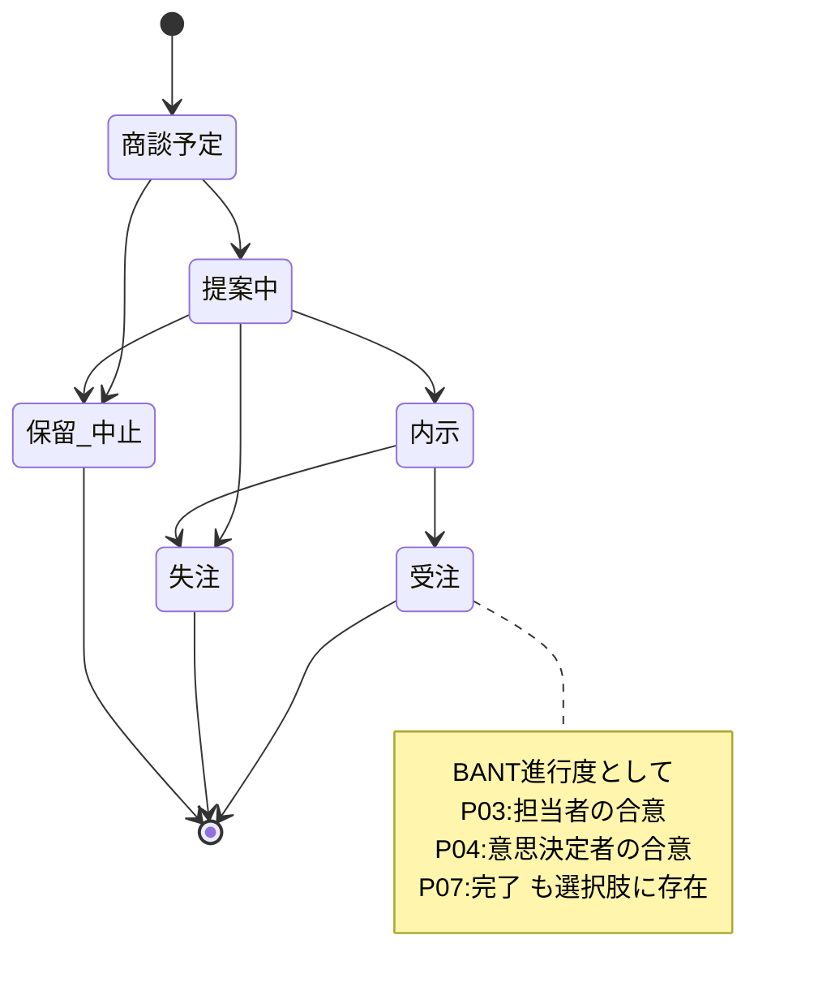

# カスタマイズ入門.sptpl 解析レポート

kintoneスペーステンプレート(.sptpl)。ZIPアーカイブ形式で、内包する `space/template.json` を解析し、アプリ構成・フィールド定義・アプリ間連携・カスタマイズJSを抽出した。

- アプリ数: 7
- アプリアクション（自動転記）: 6
- JSカスタマイズファイル: 3（2アプリ）
- 共通適用プラグイン: 1

## 1. ファイル形式

`.sptpl` は実体がZIPアーカイブで、展開すると以下の構造になっている。

| パス | 内容 |
|---|---|
| `space/template.json` | スペース定義本体。全アプリのフィールド・レイアウト・ビュー・レポート・アプリアクションをJSONで保持 |
| `space/signature` | テンプレートの署名ファイル |
| `space/{UUID}` | アプリアイコン画像・カスタマイズJSファイルの実体（UUID名で格納、実ファイル名はtemplate.json側で対応付け） |

## 2. アプリ一覧

| アプリ | 概要 | フィールド数 | JS |
|---|---|---|---|
| 活動履歴 | 案件・顧客に紐づく対応履歴（電話/メール/商談等）を記録 | 12 | 1 |
| 顧客管理 | 取引先企業情報。担当者・案件・活動履歴を集約表示 | 15 | 2 |
| 案件管理 | 商談案件の進捗・売上見込み・確度を管理 | 17 | 0 |
| 担当者管理 | 取引先企業に紐づく担当者（個人）情報 | 17 | 0 |
| 見積書 | 商品リストと連携して見積書を作成 | 6 | 0 |
| 商品リスト | 型番・商品名・価格などのマスタ | 6 | 0 |
| 旅費精算申請 | 出張旅費・経費の申請（社内業務系、独立系統） | 15 | 0 |



アプリアクションのつながり（連結成分）で分類。旅費精算申請はどのアプリとも自動転記の関係がなく独立している。

## 3. アプリ間関係（ER図）

関連付けは (a) レコード追加時にレコード番号を引き継いで別アプリへ転記する「アプリアクション」、(b) 転記されたNoをキーに表示する「関連レコード一覧（REFERENCE_TABLE）」の二層構造。テンプレート出力ではREFERENCE_TABLE側の紐付け先アプリ設定は保持されないため、フィールド名とアプリアクションの転記関係から関係を推定している。





矢印の向きが転記の方向。顧客管理が起点となり担当者・案件・活動履歴へ枝分かれし、案件管理からも活動履歴へ転記される。

## 4. アプリアクション（自動転記）一覧

| アクション名 | 実行元 | → 対象 | 転記フィールド数 |
|---|---|---|---|
| 担当者を登録する | 顧客管理 | 担当者管理 | 2 |
| 案件を登録する | 顧客管理 | 案件管理 | 2 |
| 活動履歴を登録する | 顧客管理 | 活動履歴 | 2 |
| 活動履歴を登録する | 案件管理 | 活動履歴 | 4 |
| 活動履歴の登録 | 活動履歴 | 活動履歴 | 4（自己参照＝関連活動履歴の追加） |
| 担当者を追加登録する | 担当者管理 | 担当者管理 | 2（自己参照＝関連担当者の追加） |

## 5. 業務フロー概要

1. **顧客管理**に取引先企業を登録 → 会社名・都道府県・業種・請求条件（締め日/支払日）などの基本情報を保持
2. 詳細画面から**「担当者を登録する」**で**担当者管理**に遷移 → 顧客Noを引き継いだ状態で個人（姓名・連絡先・決裁権）を登録
3. 詳細画面から**「案件を登録する」**で**案件管理**に遷移 → 商談フェーズ・確度・売上見込みを管理し、パイプラインをグラフで可視化
4. 案件詳細から**「活動履歴を登録する」**で**活動履歴**に遷移 → 案件No・会社名・案件名を自動転記した状態で対応記録（電話/メール/商談等）を追加
5. 顧客管理・案件管理の詳細画面では、関連レコード一覧（REFERENCE_TABLE）で担当者一覧・案件一覧・活動履歴一覧を横断的に確認可能



1件の商談が「顧客登録 → 担当者/案件登録 → 活動履歴記録」の順で処理され、各アプリの関連レコード一覧に自動反映される。

> 見積書・商品リストは別系統：商品リストのマスタデータ（型番・商品名・単価）を見積書にコピーして明細を作成する、独立した価格提示フロー。旅費精算申請はCRM系とは無関係な社内経費申請アプリ。

## 6. カスタマイズJS・プラグイン

| アプリ | ファイル名 | 要約 |
|---|---|---|
| 活動履歴 | `j_02-02-03.js` | レコード新規作成画面表示時、「内容」欄に入力ガイド（定型の注意書き）をあらかじめセットする |
| 顧客管理 | `setGroupFieldOpen.js` | 詳細画面ではグループフィールドを開き、追加/編集画面では閉じるよう制御する |
| 顧客管理 | `setGroupFildShow.js` | 上記と同一内容（コメントも同一）。設定ミスにより同じ処理が重複登録されている可能性 |

### ソース抜粋

```javascript
// j_02-02-03.js（活動履歴）
kintone.events.on('app.record.create.show', (event) => {
  event.record['内容'].value = '※具体的な商談内容を箇条書きで簡潔に記載してください';
  return event;
});
```

```javascript
// setGroupFieldOpen.js / setGroupFildShow.js（顧客管理）
kintone.events.on('app.record.detail.show', (event) => {
  kintone.app.record.setGroupFieldOpen('グループ', true);
});
kintone.events.on(['app.record.create.show', 'app.record.edit.show'], (event) => {
  kintone.app.record.setGroupFieldOpen('グループ', false);
});
```

7アプリ全てに同一プラグイン（id: `fdeplpmkengkldpdlaiegpokgmaabkkb`）が有効化されている。見積書・商品リスト・旅費精算申請の説明文には「cybozu developer network」の公開JSサンプルで自動採番や入力チェックが追加可能との案内があるが、テンプレート自体には未組み込み。

## 7. アプリ別フィールド定義

システム項目（作成者/更新者/日時/ステータス等）は割愛し、業務項目のみ記載。

### 活動履歴（57bc63cf-…）

案件に紐づく活動履歴を管理。案件Noに紐づけてデータ入力することで、案件ごとの活動履歴を一画面で確認できる。

| ラベル | 型 | var | 備考 |
|---|---|---|---|
| 活動履歴No. | RECORD_ID | レコード番号 | 必須 |
| 対応日付 | DATE | 対応日付 | |
| 対応種別 | SINGLE_SELECT | 対応種別 | 電話/メール/商談(初回・2回目以降)/その他/打ち合わせ |
| 所属組織 | ORGANIZATION_SELECT | 所属組織 | |
| 対応者 | USER_SELECT | 対応者 | |
| タイトル | SINGLE_LINE_TEXT | タイトル | |
| 内容 | MULTIPLE_LINE_TEXT | 内容 | |
| 添付ファイル | FILE | 添付ファイル | |
| 会社名／案件名 | SINGLE_LINE_TEXT | 会社名 / 案件名 | 顧客管理・案件管理からの転記用 |
| 案件No./顧客No. | DECIMAL | 案件No / 顧客No | 転記キー |
| 案件情報／関連活動履歴 | REFERENCE_TABLE | 案件情報 / 関連活動履歴 | 関連レコード一覧 |

### 顧客管理（eb0a2e41-…）

取引先企業の基本・請求情報。顧客Noに紐づく担当者・案件・活動履歴を一画面で確認できる。

| ラベル | 型 | var | 備考 |
|---|---|---|---|
| 顧客No. | RECORD_ID | 顧客No | 必須 |
| 会社名 | SINGLE_LINE_TEXT | 会社名 | |
| 顧客ランク | SINGLE_CHECK | 顧客ランク | 必須／A・B・C・D |
| 〒／都道府県／住所／建物名 | TEXT・SELECT | 郵便番号 他 | 都道府県は47都道府県フルオプション |
| 電話番号／FAX／Webサイト | LINK | 各項目 | |
| 業種 | SINGLE_SELECT | 業種 | 17業種オプション（重複あり） |
| 締め日／支払日 | SINGLE_SELECT | 締め日 / 支払日 | 請求サイト設定 |
| 顧客情報メモ欄 | MULTIPLE_LINE_TEXT | 顧客情報メモ欄 | |
| 担当者一覧／案件一覧／活動履歴一覧 | REFERENCE_TABLE | 各一覧 | 関連アプリを横断表示 |
| グループ | GROUP | グループ | 顧客No・作成/更新情報を格納、JSで開閉制御 |

### 案件管理（0bf25fe4-…）

商談案件の進捗管理。パイプライン状況をグラフで可視化。

| ラベル | 型 | var | 備考 |
|---|---|---|---|
| 案件No. | RECORD_ID | 案件No_ | 必須 |
| 会社名／顧客No. | TEXT/DECIMAL | 会社名 / 顧客No_ | 顧客管理からの転記キー |
| 案件名 | SINGLE_LINE_TEXT | 案件名 | |
| 主担当／主担当組織 | USER_SELECT/ORG | 主担当 他 | |
| 商談フェーズ | SINGLE_SELECT | 商談フェーズ | 商談予定〜受注/失注/保留 等9段階（下記ステート図） |
| 確度 | SINGLE_SELECT | 確度 | 100%/80%/60%/40%/20% |
| 受注予定日／初回商談日／次回アクション日 | DATE | 各項目 | |
| 売上 | DECIMAL | 売上 | 単位 ¥ |
| 提案商品 | SINGLE_SELECT | 提案商品 | 商品A/B/C/その他 |
| 契約書/申込書 | FILE | 契約書_申込書 | |
| 詳細／アクション内容 | MULTIPLE_LINE_TEXT/TEXT | 各項目 | |
| アクション担当者 | USER_SELECT | アクション担当者 | |
| 活動履歴／関連レコード一覧 | REFERENCE_TABLE | 活動履歴 / 同一顧客向け案件 | |



「商談フェーズ」フィールドの選択肢から復元した案件のライフサイクル。受注/失注/保留・中止で終了する。

### 担当者管理（e3a16406-…）

取引先企業に紐づく個人担当者情報。

| ラベル | 型 | var | 備考 |
|---|---|---|---|
| 担当者No. | RECORD_ID | 担当者No_ | 必須 |
| 顧客名／顧客No. | TEXT/DECIMAL | 顧客名 / 顧客No_ | 顧客管理からの転記キー |
| 姓／名／フリガナ／お名前 | SINGLE_LINE_TEXT | 各項目 | 姓名を分割＋結合表示用フィールドあり |
| 部署／役職 | SINGLE_LINE_TEXT | 各項目 | |
| 電話番号／携帯番号／メールアドレス | LINK | 各項目 | |
| 決裁権 | SINGLE_CHECK | 決裁権 | 必須／なし・あり |
| 備考 | MULTIPLE_LINE_TEXT | 備考 | |
| 添付ファイル（名刺等） | FILE | 添付ファイル_名刺等 | |
| 関連担当者情報 | REFERENCE_TABLE | 同一企業担当者 | |

### 見積書（776f326e-…）

商品リストと連携し、型番・商品名・単価をコピーして見積書を作成。

| ラベル | 型 | var | 備考 |
|---|---|---|---|
| レコード番号 | RECORD_ID | レコード番号 | 必須 |
| 見積番号／見積日 | TEXT/DATE | 各項目 | |
| 宛名 | SINGLE_LINE_TEXT | 宛名 | |
| 合計金額 | CALC | 合計金額 | 計算フィールド |
| 備考 | MULTIPLE_LINE_TEXT | 備考 | |

### 商品リスト（bab2a845-…）

型番・商品名などの商品マスタ。見積書アプリにコピー可能。

| ラベル | 型 | var | 備考 |
|---|---|---|---|
| レコード番号 | RECORD_ID | レコード番号 | 必須 |
| サービス種別 | SINGLE_CHECK | サービス種別 | 必須／kintone,Office,Garoon 等7種 |
| 型番／商品名 | SINGLE_LINE_TEXT | 各項目 | |
| 価格 | DECIMAL | 価格 | |
| 特記事項 | MULTIPLE_LINE_TEXT | 特記事項 | |

### 旅費精算申請（c9a696ba-…）

出張の旅費・経費申請。他アプリとの連携なし（独立業務）。

| ラベル | 型 | var | 備考 |
|---|---|---|---|
| No | SINGLE_LINE_TEXT | No | 必須 |
| 申請者／上長 | USER_SELECT | 各項目 | 申請者は必須 |
| 期間（出発／帰着） | DATE | 出発 / 帰着 | |
| 地域 | SINGLE_SELECT | 地域 | 首都圏/関東/関西/東海/東北/中部・北陸/海外/その他 |
| 行き先／目的 | SINGLE_LINE_TEXT | 各項目 | |
| 日当 | DECIMAL | 日当 | |
| 旅費合計／経費合計／精算金額 | CALC | 各項目 | 計算フィールド |
| 備考 | MULTIPLE_LINE_TEXT | 備考 | |
| グループ | GROUP | グループ | 申請者・作成/更新情報を格納 |

---

出典: `Z:\kintone\カスタマイズ入門.sptpl`（`space/template.json`）を kintone-sptpl-analyzer スキルで解析。REFERENCE_TABLEの紐付け先アプリ設定はテンプレート出力上保持されないため、フィールド命名とアプリアクションの転記関係から関係を推定している。
